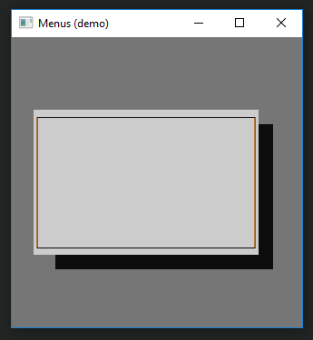
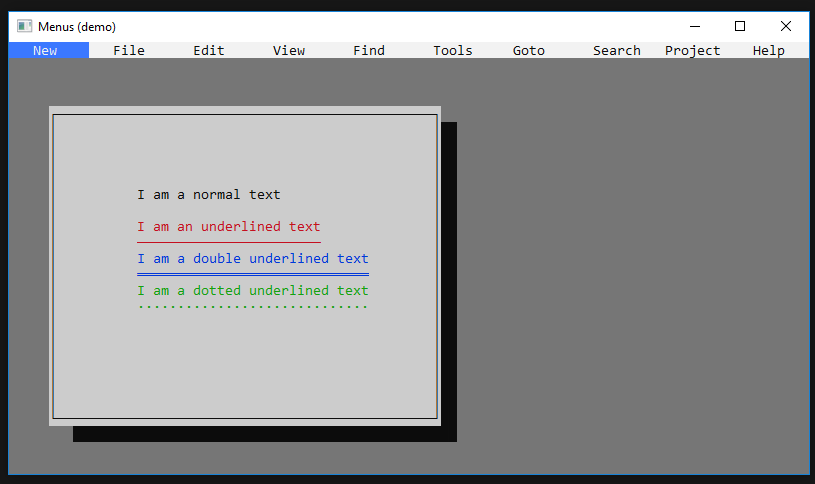
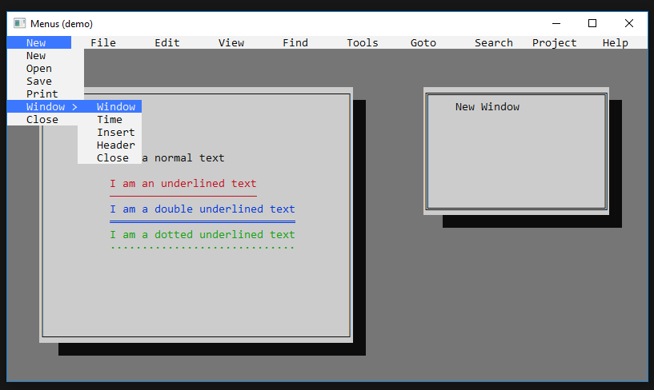

# Menus
> Menus is a Borland-inspired graphics library that is built on a custom multimedia (DLL) dynamic link library **vain engine**
> to create basic GUI elements.

# #Getting Started
> For a new project, Add the `libVain Engine.a` library to the linker and copy the `Vain-Engine.dll` file from the lib folder to the main directory where 
> you'll be running the program.
> Use the namespace `eng` for the **Vain-Engine** library functions.

### Note: 
Run `build.sh` file to compile and build the project.

## Usage

> ### Horizontal Menus: 
```c++
    typedef eng::Color::HexaDecimalColours Color;
    const Color DEFAULT   = eng::Color.BRIGHT_WHITE_BLACK;
    const Color HIGHLIGHT = eng::Color.BRIGHT_BLUE_BRIGHT_WHITE;

    
    // pass vector initializer list...
    std::unique_ptr<Menu> h_menu(new HorizontalMenu({
            {" File ", HIGHLIGHT},
            {" Edit ", DEFAULT},
            {" View ", DEFAULT},
            {" Help ", DEFAULT},
        }, 
        Coordinate(0, -1)
    ));
    
    // initialize theme data....
    h_menu->setTheme(Theme(DEFAULT, HIGHLIGHT));
    
    for (;;) {
    
        while(!h_menu->isItemSelected()){
            h_menu->render();
        }
        
        // must be called to re-initialize the process
        h_menu->restart();
        
        switch(h_menu->getItemPosition()){
            case 1:
                /* Do stuff from here */
            break;
            
            case 2:
                /* Do stuff from here */
            break;
            
            case 3:
                /* Do stuff from here */
            break;
        }
    }
```

> ### Verical Menus: 
```c++
    std::unique_ptr<Menu> v_menu(new VerticalMenu({
            {" New   ", HIGHLIGHT},
            {" Open  ", DEFAULT},
            {" Save  ", DEFAULT},
            {" Print ", DEFAULT},
        }, 
        Coordinate(0, 0)
    ));
    
    v_menu->setTheme(Theme(DEFAULT, HIGHLIGHT));

```


> ### Frames: 
```c++
    std::unique_ptr<Window> frame(new Frame(Dimension(10, 30), 
        Coordinate(3,5))
    );
        
    frame->enableShadow(true);
    frame->render();
```


> ## Build Previews:




